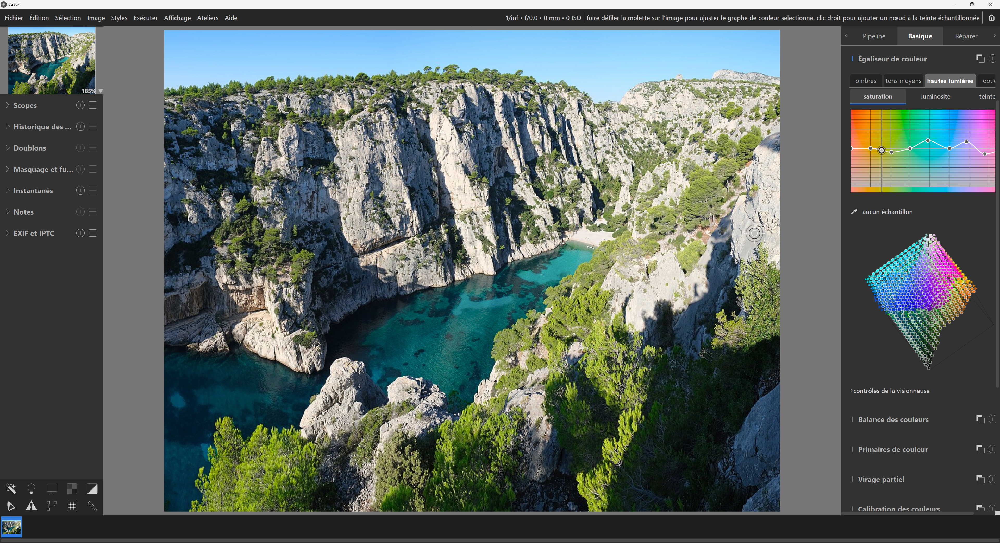

# Ansel — Lightroom CC Theme

A CSS theme / tweaks file that reskins [Ansel](https://ansel.photos) (the darktable fork)
to look and feel closer to Adobe Lightroom CC: dark neutral palette, blue accent instead
of the default orange, airier module spacing, and no separator lines between panels.

<!-- Replace this with your own screenshot once you've applied the theme -->

## What it changes

- Neutral dark grey palette instead of Ansel's default warm greys
- Blue accent (`#2f7de1`) for slider values, module enable buttons, selections and checkmarks
- Heavier font weight (500) for better readability on high-DPI / 4K displays
- More generous margins and padding around modules and sliders
- Removed the light separator lines between module sections
- System-font stack (Segoe UI / Source Sans Pro / Roboto / Helvetica Neue) instead of Ansel's default

## Installation

1. Open Ansel and go to **Preferences > General**.
2. Make sure the **theme** dropdown is set to `Ansel` (this file is applied *on top* of it).
3. Copy the entire contents of [`lightroom-cc-v4-tweaks.css`](./lightroom-cc-v4-tweaks.css)
   into the **CSS tweaks** text box at the bottom of the General tab.
4. Check **"modify selected theme with CSS tweaks below"**.
5. Click **"save CSS and apply"**.
6. Restart Ansel for the changes to fully take effect.

## Notes

- Ansel keeps the darkroom/lighttable canvas at a scientifically "middle grey" by default,
  to avoid biasing your perception of exposure and color while editing. This theme overrides
  that to a darker canvas for a closer visual match to Lightroom — if you'd rather keep the
  more accurate middle-grey canvas, comment out the `darkroom_bg_color` / `lighttable_bg_color`
  lines near the top of the CSS file.
- GTK's CSS engine does not support the `text-transform` property, so this theme can't force
  Title Case on module/button labels — that comes from Ansel's translated strings, not the theme.
- Native window title bars (e.g. on macOS, or Windows without CSD) are drawn by the OS and are
  outside the reach of any GTK theme.

## Compatibility

Built against Ansel's CSS structure as of 2026. Ansel's internal CSS structure changes
fairly often between releases, so some rules may need adjusting after an update — if
something looks off, open the GTK Inspector (`GTK_DEBUG=interactive ansel`) to check the
current class/id names.

## License

MIT — see [LICENSE](./LICENSE).
